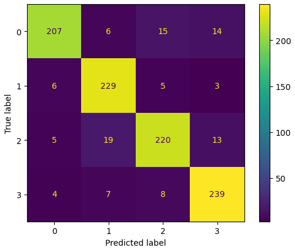
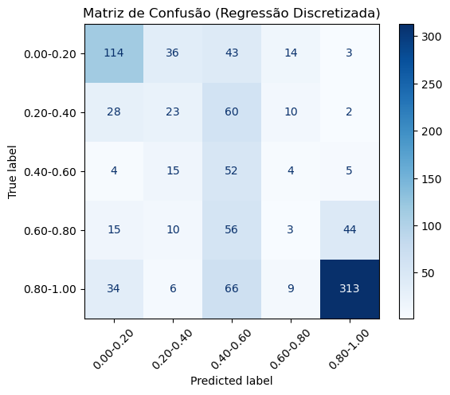

# UTFPR/Curitiba - SISTEMAS INTELIGENTES – 2025/2 – Prof. Tacla
## João Pedro de Pieri Batista da Silva - 2424525 - BSI

### Técnicas escolhidas

A triagem média deve ser algo simples de ser feita, além de seguir uma lógica replicável, por este motivo foi escolhida a árvore de decisão, que resolve melhor o problema de classificação para uma triagem, ao mesmo tempo que não chega a ser uma solução tão eficiente para a regressão, tentando descobrir chance de sobrevivência (de 0 a 100).

**Escolha Realizada:** CART para classificação e MLP/Redes Neurais para regressão

---

# Classificador CART

## 1) Datasets Utilizados

**Dataset de Treino/Validação:**
- Origem: Gerado com a função `gerar_dados_vitimas.py`
- Parâmetros de criação: (Foram utizados parâmetros já presentes na main do gerador, com exceção do número de vítimas)
- n_vitimas=800,
- media_idade=25,
- desvio_idade=3,
- tipo_acidente="uniforme",
- nivel_ruido=0.02

**Dataset de Teste:**
- Origem: VictSim3/datasets/vict/1000v/data.csv
- Número de vítimas: 1000

**K-fold:**
- Classificação: 5 folds
- Regressão: 5 folds

---

## 2) Parametrizações - Classificador

**P1:**
- max_depth: 2
- min_samples_leaf: 0.23
- random_state: 42

**P2:**
- max_depth: 1
- min_samples_leaf: 0.20
- random_state: 42

**P3:**
- max_depth: 5
- min_samples_leaf: 0.25
- random_state: 42

---

## 3) Resultados de Treino e Validação - Classificador

### P1:
| f-score    | Fold K=1 | Fold K=2 | Fold K=3 | Fold K=4 | Fold K=5 | Média  | Variância |
|------------|----------|----------|----------|----------|----------|--------|-----------|
| treino     | 0.985    | 0.987    | 0.992    | 0.983    | 0.985    | 0.9866 | 0.000008 |
| validação  | 0.992    | 0.983    | 0.966    | 1.000    | 0.992    | 0.986572 | 0.000130 |

### P2:
| f-score | Fold K=1 | Fold K=2 | Fold K=3 | Fold K=4 | Fold K=5 | Média | Variância |
|---------|----------|----------|----------|----------|----------|-------|-----------|
| treino | 0.335 | 0.337 | 0.336 | 0.334 | 0.333 | 0.3348 | 0.000002 |
| validação | 0.333 | 0.328 | 0.331 | 0.341 | 0.341 | 0.334762 | 0.000002 |

### P3:
| f-score | Fold K=1 | Fold K=2 | Fold K=3 | Fold K=4 | Fold K=5 | Média | Variância |
|---------|----------|----------|----------|----------|----------|-------|-----------|
| treino | 0.954 | 0.643 | 0.658 | 0.977 | 0.982 | 0.8307 | 0.024741 |
| validação | 0.935 | 0.627 | 0.652 | 0.967 | 0.983 | 0.830669 | 0.024849 |

---

## 4) Médias dos F-scores - Classificador

| MÉDIA f-score | P1 | P2 | P3 |
|---------------|--------------|-------------|------------------|
| treino | 0.9866 | 0.3348 | 0.8307 |
| validação | 0.986572 | 0.334762 | 0.830669 |

---

## 5) Comparação das Variâncias dos F-scores - Classificador

| VARIÂNCIA f-score | P1 | P2 | P3 |
|-------------------|--------------|-------------|------------------|
| treino | 0.000008 | 0.000002 | 0.024741 |
| validação | 0.000130 | 0.000026 | 0.024849 |

---

## 6 - 7) Escolha de uma Parametrização - Classificador

**Parametrização Escolhida: P1*

Além das três parametrizações foram testados outros valores para os parâmetros, e foi percebido que profundidade máxima maior que 1 já era suficiente para não demonstrar tanta diferença em relação a outros parâmetros, assim como n mínimo de amostras por folhas, desde que maior que 23% (0.23) também era número ideal para um modelo, aumentar não alterava o resultado do modelo, enquanto diminuir o afetava negativamente. Dito isso foi escolhido a primeira parametrização, de forma a alcançar resultado eficaz e diminuir a complexidade da árvore. Além disso não foi encontrada nada que levasse a acreditar que estivesse ocorrendo um overfitting, e o próprio f-score já descarta a possibilidade de underfitting.

---

## 8) Resultados do Teste Cego - Classificador

**Métricas de Performance:**
- **F-score:** 0.8948
- **Precisão geral:** 0.8963
- **Recall geral:** 0.8948

**Matriz de Confusão**

---

## 9) Conclusão - Classificador

Por serem dados gerados proceduralmente, aparentemente não há tanto ruído entre eles, ao usar os padrões já descritos na função main o dataset inicial tinha cerca de 2% de ruído, e pela boa predição no dataset inicial (cerca de 0.98 de fscore) acredito que se trate de uma função legivel computacionalmente, apenas afetada pelo ruído escolhido, apesar de não conseguir medir o ruído no dataset de teste para predição após escolha do modelo, não seria surpresa que o ruído estivesse próximo de sua taxa de falha, o classificador parece ser bem eficaz no que ele foi desenvolvido, apesar da diferença entre os fscores, deve ser relacionada a diferença da qualidade dos datasets, o treino em um dataset mais limpo por sua vez parece não ter gerado um overfitting do modelo.

---

# Regressos MLP/Redes Neurais

## 1) Datasets Utilizados

Ambos datasets e quantidade de folds no k-fold foi igual a utilizada para desenvolvimento do classificador.

---

## 2) Parametrizações - Regressor

**P1:**
- n_layers: 2
- n_neurons: 2
- learning_rates: 0.01
- random_state: 42

**P2:**
- n_layers: 6
- n_neurons: 10
- learning_rates: 0.025
- random_state: 42

**P3:**
- n_layers: 30
- n_neurons: 30
- learning_rates: 0.035
- random_state: 42

---

## 3) Resultados de Treino e Validação - Regressor

### P1:
| MSE | Fold K=1 | Fold K=2 | Fold K=3 | Fold K=4 | Fold K=5 | Média  | Variância |
|------------|----------|----------|----------|----------|----------|--------|-----------|
| treino     | -0.11331867 | -0.11943828 | -0.11570488 | -0.11501407 | -0.11566706 | -0.115829 | 0.000005 |
| validação  | -0.12639919 | -0.10103001 | -0.11768912 | -0.11943393 | -0.11603349 | -0.116117 | 0.000087 |

### P2:
| MSE | Fold K=1 | Fold K=2 | Fold K=3 | Fold K=4 | Fold K=5 | Média | Variância |
|---------|----------|----------|----------|----------|----------|-------|-----------|
| treino | -0.01367758 | -0.04410777 | -0.01203441 | -0.0398772 | -0.01175755 | -0.024291 | 0.000264 |
| validação | -0.00949561 | -0.03401594 | -0.01431698 | -0.05122582 | -0.01524142 | -0.024859 | 0.000305 |

### P3:
| MSE | Fold K=1 | Fold K=2 | Fold K=3 | Fold K=4 | Fold K=5 | Média | Variância |
|---------|----------|----------|----------|----------|----------|-------|-----------|
| treino | -0.04368503 | -0.04404468 | -0.04110191 | -0.03987384 | -0.04160527 | -0.042062 | 0.000003
| validação | -0.03609366 | -0.03378463 | -0.04629813 | -0.05125908 | -0.0440804 | -0.042303 | 0.000053 |

---

## 4) Médias dos MSE - Regressor

| MÉDIA MSE | P1 | P2 | P3 |
|---------------|--------------|-------------|------------------|
| treino | -0.115829 | -0.024291 | -0.042062 |
| validação | -0.116117 | -0.024859 | -0.042303 |

---

## 5) Comparação das Variâncias dos MSE - Regressor

| VARIÂNCIA MSE | P1 | P2 | P3 |
|-------------------|--------------|-------------|------------------|
| treino | 0.000005 | 0.000264 | 0.000003 |
| validação | 0.000087 | 0.000305 | 0.000053 |

---

## 6 - 7) Escolha de uma Parametrização - Regressor

**Parametrização Escolhida: P2*

As três parametrizações foram feitas da seguinte forma: Uma mais rápida e enxuta (P1), enquanto outra é mais moderada, apesar de possuir mais camadas e neurônios não chega a ser tão complexa ou demorada de treinar (P2), e por fim uma parametrização mais complexa, mais camadas e mais neurônios, com um learning rate maior, um tanto quanto agressiva.
Verificando os resultados é possivel ver que a parametrização 1 possui resultados bem fracos, enquanto a segunda e a terceira possuem resultado relativamente similar, ambos são MSE próximos de zero, porém a parametrização 2 possui quase que metade do MSE da terceira. Ao observar a variância percebemos que a parametrização 2 varia mais entre folds do que as demais, ainda assim os números são baixos.
Apesar da variância, foi escolhida a parametrização 2, por ser uma parametrização mais moderada, e por possuir um menor MSE.

---

## 8) Resultados do Teste Cego - Regressor

**Métricas de Performance:**
- **MSE Negativo:** -0.068369

**Matriz de Confusão**

---'

## 9) Conclusão - Classificador

O MSE negativo apresenta uma taxa de erro significativo (-0.068369), ainda mais quando considerando que os resultados variam de 0 a 1, o modelo porém, era o melhor dentre as parametrizações possíveis, principalmente quando se tratando de MSE negativo, acredito que para a quantidade de parâmetros o resultado não é descartavel, então apesar do MSE baixo, o resultado pode sim satisfatório devido as limitações impostas pelo dataset ou até previsibilidade de uma chance de sobrevivência, processo cujo é mais complicado de ser feito do que uma simples classificação como no modelo anterior, é cabível então, ainda mais ao considerar os resultados preliminares das demais parametrizações, que seja um limite imposto pelos propríos dados, um bom exemplo da área de ciência de dados é falar sobre modelos para prever o mercado financeiro em comparação com outros, uma precisão satisfatória não é universal e pode ser explicada pela complexidade da previsão de uma chance de sobrevivência.s